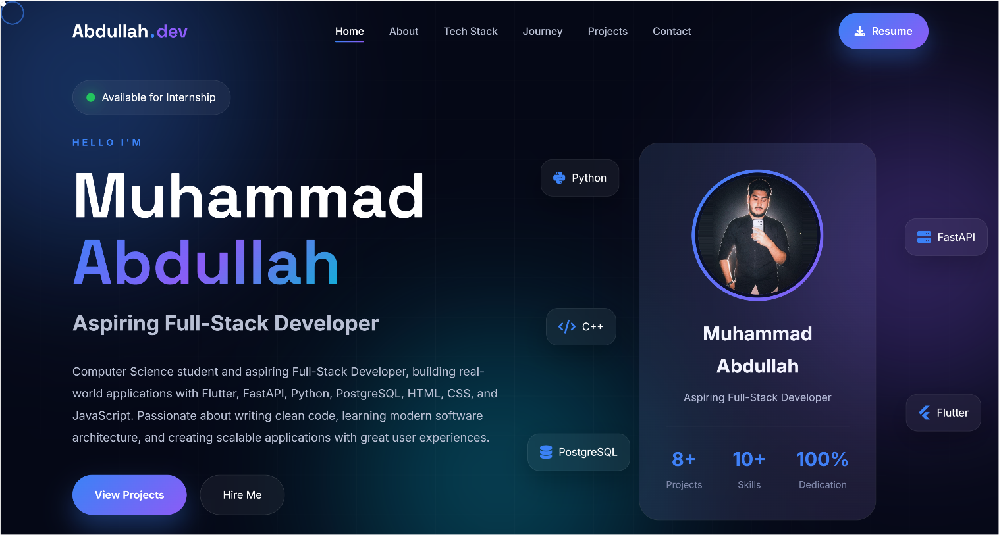
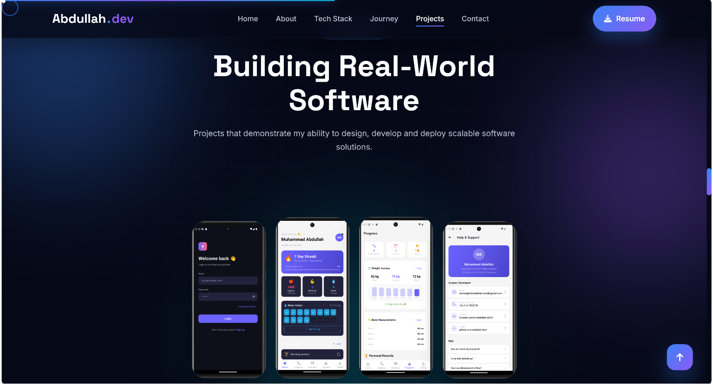
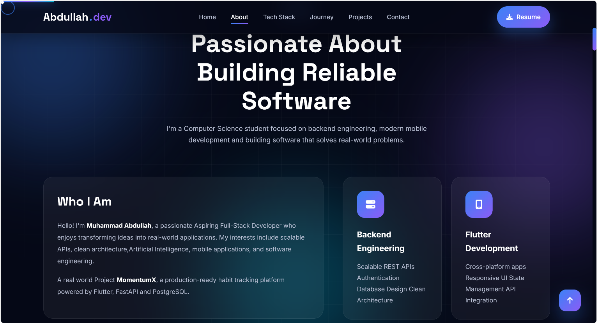

#  Personal Developer Portfolio

A modern, responsive, and professional developer portfolio showcasing my projects, skills, and journey as a Computer Science student and aspiring Full-Stack Developer.

---

## 🌐 Live Demo

👉 [Add Your Live GitHub Pages Link Here]

---

##  Preview

### 🖥️ Homepage Preview

### 📱 Projects Section

### 👤 About Section

---

##  About This Project

This portfolio represents my journey in software development, built to showcase real-world projects and technical skills gained through hands-on experience.

It highlights my work in:
- Full-stack application development
- Backend engineering with FastAPI
- Mobile development with Flutter
- Database design using PostgreSQL
- Systems programming and AI projects

---

##  Featured Projects

###  MomentumX
A production-ready full-stack fitness platform with workout tracking, habit management, nutrition logging, and secure authentication using JWT and REST APIs.

###  NEBULA OS
A C++ based operating system project implementing core OS concepts such as process scheduling, memory management, and file systems.

###  AI Smart Traffic Management System
An intelligent traffic system using ANN and CSP techniques for priority-based vehicle routing in smart cities.

###  OmniBus Management System
A database-driven system for managing bus services including booking, payments, routes, and staff management using Oracle SQL and PL/SQL.

###  Stronghold Enhanced
A large-scale C++ strategy game demonstrating advanced OOP, modular architecture, and complex game logic systems.

---

##  Tech Stack

**Frontend**
- HTML5
- CSS3
- JavaScript (Vanilla)

**Backend & Systems**
- Python
- FastAPI
- C++

**Database**
- PostgreSQL
- Oracle SQL / PL/SQL

**Other Tools**
- Git & GitHub
- REST APIs
- JWT Authentication

---

## 📂 Project Structure

portfolio/

│── index.html

│── style.css

│── script.js

│── README.md

│── .gitignore

│
├── assets/

│ ├── images/

│ │ homepage.png
│ │ projects.png
│ │ about.png
│ │

│ └── resume/
│ Muhammad_Abdullah_Resume.pdf

---

## 🎯 Goals of This Portfolio

- Showcase real-world development skills
- Demonstrate full-stack project experience
- Highlight system design and architecture understanding
- Present clean and professional UI/UX design
- Build strong developer branding for internships and opportunities

---

## 📄 Resume

📌 Download my resume here:  
`assets/resume/Muhammad_Abdullah_Resume.pdf`

---

## 👨‍💻 About Me

I am a Computer Science student passionate about building scalable, real-world software systems. I enjoy working across the stack — from designing intuitive user interfaces to building secure and efficient backend systems.

I am continuously improving my skills in:
- Full-stack development
- System design
- Artificial intelligence
- Software architecture

---

## 📬 Contact

- GitHub: https://github.com/your-username
- Email: your-email@gmail.com
- LinkedIn: https://linkedin.com/in/your-profile

---

## ⭐ Note

This portfolio is actively evolving as I continue learning and building new projects.
